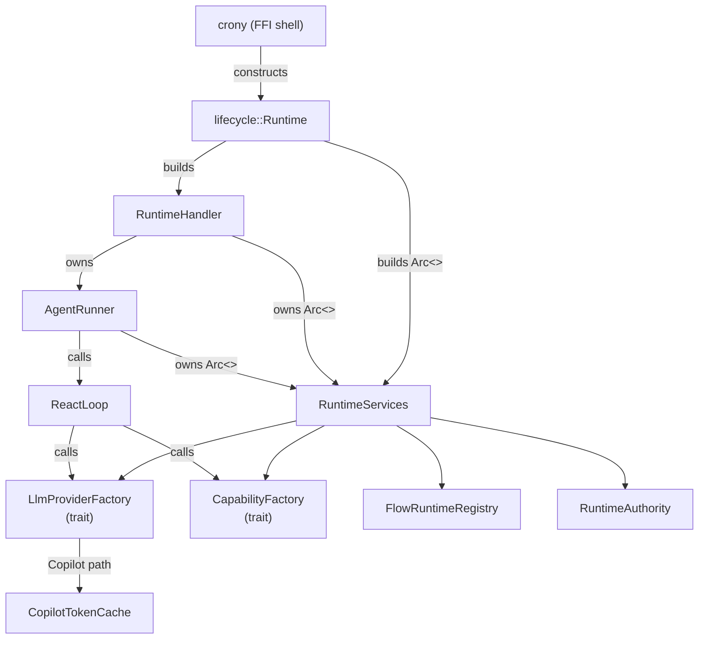
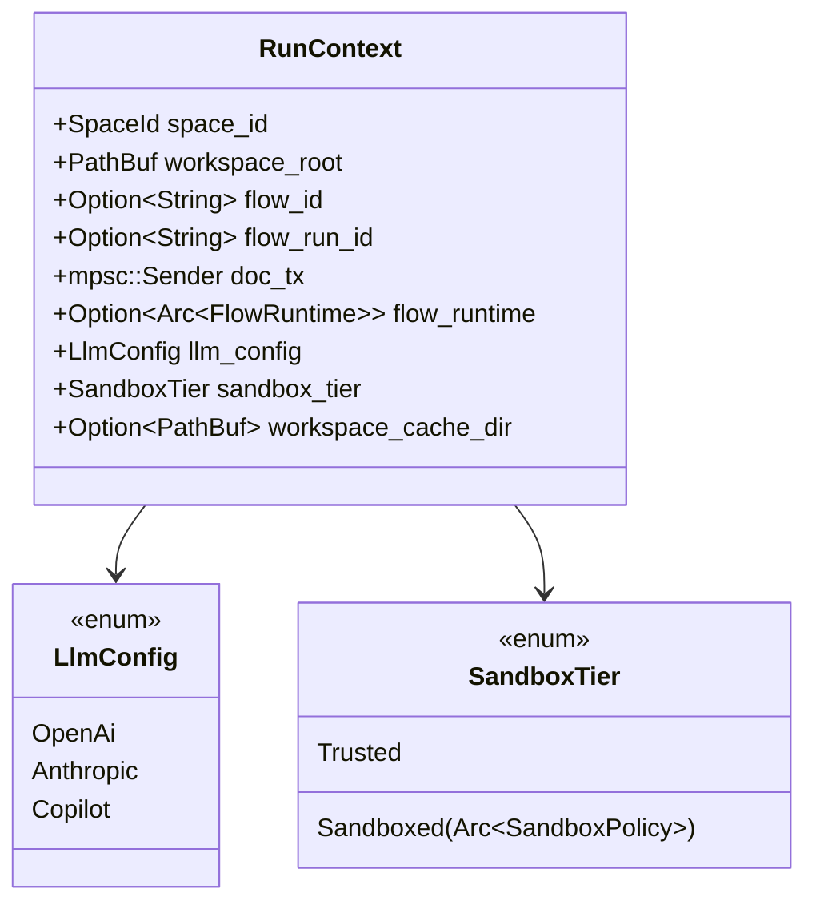
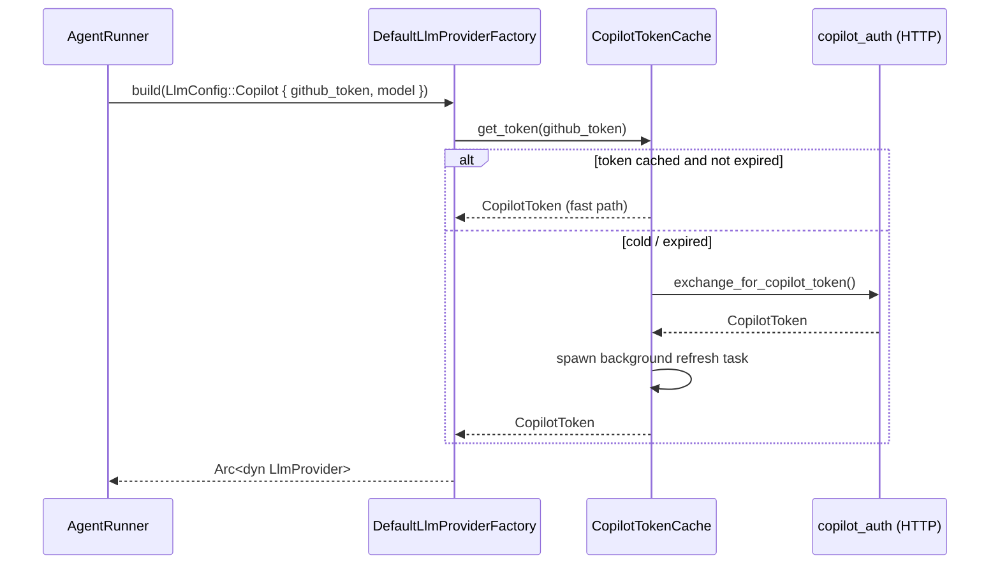
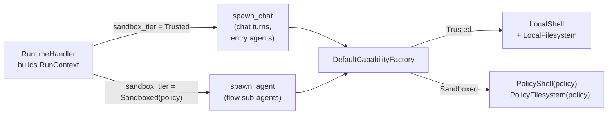
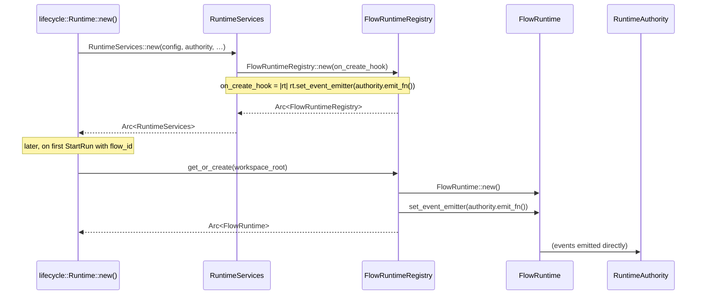
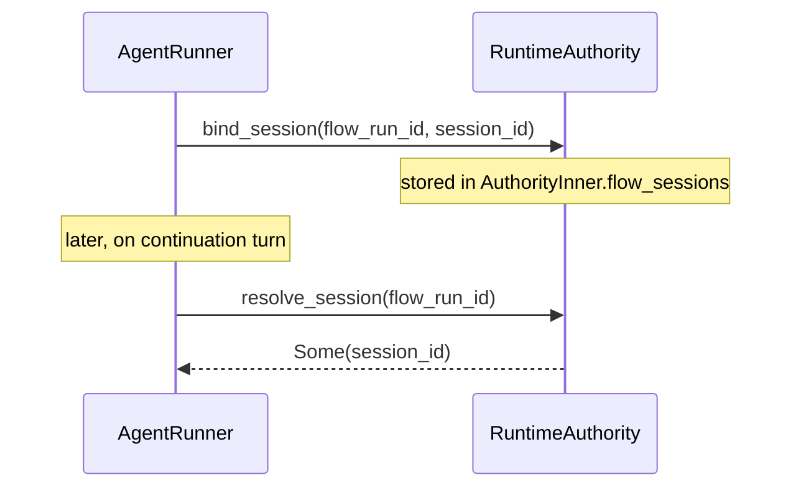
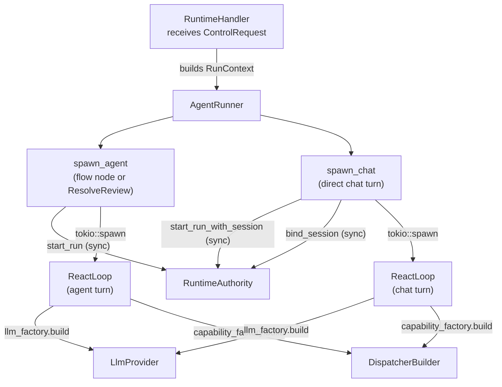

# Runtime — Layered DI Architecture

> **Status:** implemented. See `openspec/changes/runtime-layered-di/` for the
> original design rationale and per-task tracking.

`crates/cronymax` previously inlined all service construction inside
`runtime/handler.rs` — a ~1 500-line file that mixed protocol dispatch, LLM
client construction, capability wiring, and sandbox policy application.
This document describes the four-layer architecture that replaced it.

---

## Layer diagram

```
┌──────────────────────────────────────────────────────────────┐
│ Layer 4 · RuntimeHandler  (protocol adapter)                 │
│   crony FFI → ControlRequest dispatch → AgentRunner          │
│   owns Arc<RuntimeServices>                                   │
├──────────────────────────────────────────────────────────────┤
│ Layer 3 · AgentRunner  (execution layer)                     │
│   receives RunContext (per-run data) + Arc<RuntimeServices>  │
│   builds ReactLoop, runs it, forwards events                 │
├──────────────────────────────────────────────────────────────┤
│ Layer 2 · RuntimeServices  (domain service container)        │
│   built once at Runtime::new(); never rebuilt                │
│   Arc<dyn LlmProviderFactory>                                │
│   Arc<dyn CapabilityFactory>                                 │
│   Arc<FlowRuntimeRegistry>                                   │
│   Arc<RuntimeAuthority>                                      │
│   Arc<TerminalRegistry>                                      │
│   Option<Arc<MemoryManager>>                                 │
├──────────────────────────────────────────────────────────────┤
│ Layer 1 · Infrastructure  (concrete impls)                   │
│   DefaultLlmProviderFactory + CopilotTokenCache              │
│   DefaultCapabilityFactory                                   │
│   JsonFilePersistence                                        │
└──────────────────────────────────────────────────────────────┘
```

---

## Component relationships



---

## RunContext — per-run data bag

`RunContext` travels from `RuntimeHandler` down to `AgentRunner` and carries
only data that is specific to a single run invocation. It deliberately contains
**no service pointers**.



---

## LLM provider construction

Each agent spawn resolves an `Arc<dyn LlmProvider>` through the factory.
The `CopilotTokenCache` avoids a 30-second token exchange on every spawn.



Background refresh fires at `expires_at − 60 s`; the refresh task holds a
`watch::Receiver` and cancels itself when the `CopilotTokenCache` is dropped
(the matching `watch::Sender` is stored in `CacheEntry._cancel_tx`).

---

## Sandbox tier dispatch

`SandboxTier` is set by `RuntimeHandler` when it builds a `RunContext` and is
consumed by `DefaultCapabilityFactory` — no conditional lives in `AgentRunner`.



---

## Flow runtime integration

`FlowRuntimeRegistry` sits in `RuntimeServices` and lazily creates one
`FlowRuntime` per workspace. The event emitter is wired at construction so
`FlowRuntime` lifecycle events flow directly to `RuntimeAuthority` subscribers
without any code in `handler.rs` bridging the two.



### Session routing

Chat session ids are stored in `RuntimeAuthority` (not in `FlowRuntime`), keyed
by `flow_run_id`. This makes sessions discoverable across re-entry without
coupling `FlowRuntime` to the HTTP session layer.



---

## AgentRunner — execution lifecycle

`AgentRunner` replaces the two free functions `spawn_agent_loop` and
`spawn_chat_turn` that previously lived in `handler.rs`. It calls
`authority.start_run[_with_session]` **synchronously** before spawning the async
task, so the run is always registered before any response is returned.



### System message rendering

`InvocationContext` no longer carries a pre-rendered `system_message: String`.
`AgentRunner::render_system_message(inv_ctx)` renders it from the structured
fields (trigger kind, available docs, pending ports, reviewer feedback) at the
point of use, keeping prompt logic out of the data model.

---

## Testing seam

Because `RuntimeServices` holds `Arc<dyn LlmProviderFactory>` and
`Arc<dyn CapabilityFactory>`, integration tests can swap in fakes without
touching any other layer:

```rust
// In tests/agent_runner_test.rs
let services = Arc::new(RuntimeServices {
    authority: auth.clone(),
    flow_registry: Arc::new(FlowRuntimeRegistry::default()),
    llm_factory: Arc::new(MockLlmFactory::new()),     // no HTTP
    capability_factory: Arc::new(FakeCapabilityFactory),
    terminal_managers: Arc::new(Mutex::new(HashMap::new())),
    memory_manager: None,
});
let runner = AgentRunner::new(services);
runner.spawn_agent(run_ctx, "agent-id".into(), inv_ctx);
```

`MockLlmFactory` (in `crates/cronymax/src/llm/mock.rs`) returns a
`MockLlmProvider` that replays a scripted sequence of `LlmEvent`s.
`FakeCapabilityFactory` (in `crates/cronymax/src/capability/factory.rs`,
gated on `cfg(any(test, feature = "testing"))`) builds a no-op dispatcher.

---

## File map

| Path                                          | Role                                        |
| --------------------------------------------- | ------------------------------------------- |
| `crates/cronymax/src/runtime/services.rs`     | `RuntimeServices` struct + `new()`          |
| `crates/cronymax/src/runtime/agent_runner.rs` | `AgentRunner`, `RunContext`                 |
| `crates/cronymax/src/runtime/run_context.rs`  | `RunContext` struct                         |
| `crates/cronymax/src/runtime/handler.rs`      | `RuntimeHandler` (protocol adapter)         |
| `crates/cronymax/src/llm/factory.rs`          | `LlmProviderFactory` trait + default impl   |
| `crates/cronymax/src/llm/copilot_cache.rs`    | `CopilotTokenCache`                         |
| `crates/cronymax/src/llm/config.rs`           | `LlmConfig` enum                            |
| `crates/cronymax/src/llm/mock.rs`             | `MockLlmFactory` / `MockLlmProvider`        |
| `crates/cronymax/src/capability/factory.rs`   | `CapabilityFactory` trait + impls           |
| `crates/cronymax/src/capability/tier.rs`      | `SandboxTier` enum                          |
| `crates/cronymax/src/flow/registry.rs`        | `FlowRuntimeRegistry`                       |
| `crates/cronymax/src/lifecycle.rs`            | composition root — builds `RuntimeServices` |
| `crates/cronymax/tests/agent_runner_test.rs`  | integration tests                           |
