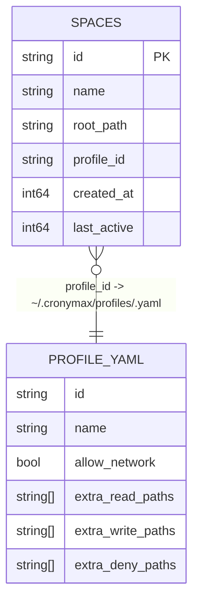
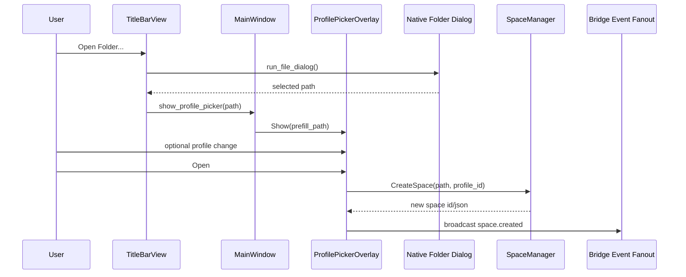
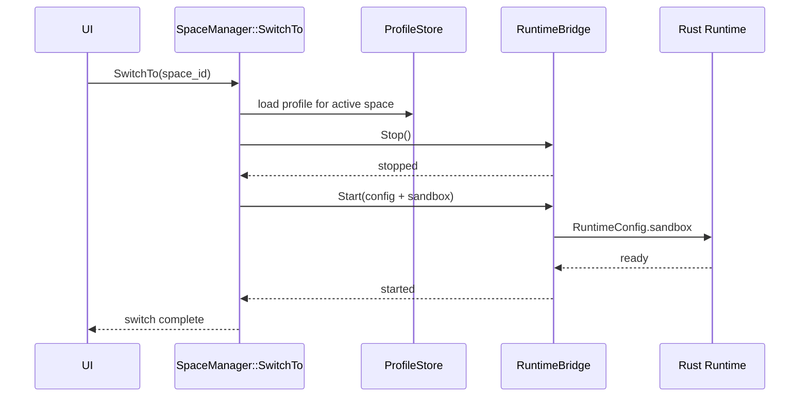
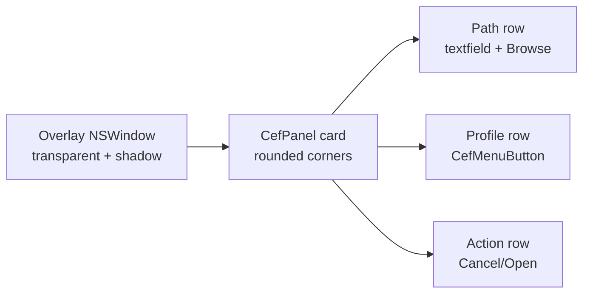

# Workspace With Profile Design

This document captures the implemented architecture for `workspace-with-profile`, including data flow, module layout, and runtime/security enforcement.

## Scope

The feature introduces reusable sandbox profiles that are decoupled from workspaces, and routes those policies into runtime enforcement.

Implemented outcomes:

- Global profile store in `~/.cronymax/profiles/*.yaml`
- `spaces.profile_id` persisted in SQLite
- Native folder-open + profile picker flow
- Runtime restart on space switch with profile-derived sandbox config
- C++ sensitive-path hard floor + Rust sandbox policy enforcement

## Module Structure (Current)

```mermaid
graph TD
  TB[TitleBarView]
  PPO[ProfilePickerOverlay\napp/browser/views/profile_picker_overlay.*]
  MW[MainWindow]
  BH[BridgeHandler]
  SM[SpaceManager\napp/browser/models/space_manager.*]
  PS[ProfileStore\napp/browser/models/profile_store.*]
  SS[SpaceStore\napp/workspace/space_store.*]
  RB[RuntimeBridge]
  RH[Rust RuntimeHandler]
  LS[LocalShell]
  WS[WorkspaceScope]

  TB -->|show_profile_picker(path)| MW
  MW --> PPO
  PPO -->|get_profiles| PS
  PPO -->|create_space(path, profile_id)| SM
  SM --> SS
  SM --> PS
  SM --> RB
  RB --> RH
  RH --> LS
  RH --> WS
  BH --> SM
```

## Data Model



Default profile is materialized if missing:

```yaml
id: default
name: Default
allow_network: true
extra_read_paths: []
extra_write_paths: []
extra_deny_paths: []
```

## Open Folder + Profile Picker Flow



Notes:

- Space name is derived from folder basename.
- Open button is enabled when a non-empty path is present.

## Space Switch + Runtime Restart



Runtime config extension:

```json
{
  "sandbox": {
    "workspace_root": "/abs/path",
    "allow_network": true,
    "extra_read_paths": [],
    "extra_write_paths": [],
    "extra_deny_paths": []
  }
}
```

## Enforcement Graph

```mermaid
flowchart TD
  C[Capability request\n(shell/filesystem)] --> S{IsSensitivePath?\nC++ hard floor}
  S -->|yes| D1[deny]
  S -->|no| R[forward to Rust runtime]
  R --> P{SandboxPolicy allow?\n(LocalShell/WorkspaceScope)}
  P -->|no| D2[deny]
  P -->|yes| A[execute]
```

Sensitive-path deny list is non-overridable by profile rules.

## Native Overlay Rendering Design



Implementation notes:

- Card rounding and shadow are applied at the overlay window/card container layer.
- Per-button corner radius is constrained by CEF Views compositor behavior (buttons are not exposed as independently styleable AppKit controls).

## Decisions Summary

- **D1** Profiles stored as YAML files in home dir (`~/.cronymax/profiles`) rather than SQLite.
- **D2** `spaces.profile_id` migration is additive with default `default`.
- **D3** Space name is folder basename.
- **D4** Space switch performs blocking runtime restart with new sandbox config.
- **D5** `IsSensitivePath` is an always-on C++ hard floor.
- **D6/D9 (implemented)** Folder picking and profile selection are native CEF views flow; dead web picker path removed.
- **D7** Built-in `default` profile is recreated when missing and cannot be deleted.
- **D8** Invalid extra paths are warned, not activation-blocking.

## File Map (Post-Refactor)

- `app/browser/views/profile_picker_overlay.h`
- `app/browser/views/profile_picker_overlay.cc`
- `app/browser/models/profile_store.h`
- `app/browser/models/profile_store.cc`
- `app/browser/models/space_manager.h`
- `app/browser/models/space_manager.cc`

## Migration Notes

Database:

- `ALTER TABLE spaces ADD COLUMN profile_id TEXT NOT NULL DEFAULT 'default'`

Filesystem:

- Ensure `~/.cronymax/profiles/default.yaml` exists
- Legacy `.cronymax/space.profile.yaml` files are ignored
